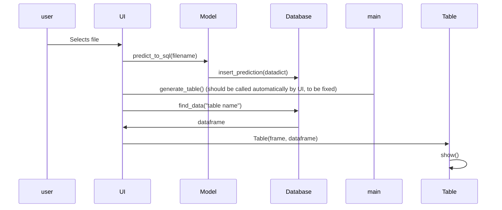
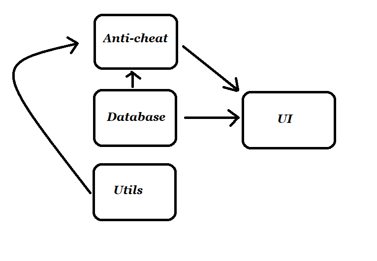

# Arkkitehtuuri

```mermaid

sequenceDiagram
    user->>UI: Selects file
    UI->>Model: predict_to_sql(filename)
    Model->>Database: insert_prediction(datadict)   
    
    main->UI: generate_table() (should be called automatically by UI, to be fixed)
    UI->>Database: find_data("table name")
    Database->>UI: dataframe
    UI->>Table: Table(frame, dataframe)
    Table->>Table: show()
```

