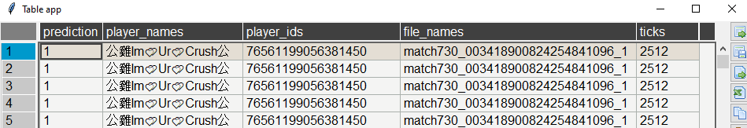

# Käyttöohje
Lataa uusin koodi releasesta.
- [Releases](https://github.com/LaihoE/ot-harjoitustyo/releases/)


## Asennus

```bash
poetry install
```


## Voit kokeilla sovellusta ajamalla
```bash
poetry run invoke start
```
Tämän pitäisi avata file explorer jolla pysyt navigoimaan src/csvs kansioon 
ja valita csv tiedosto. Parin sekunnin jälkeen pitäisi avautua seuraavanlainen ikkuna:


# Terminal output mahdollisuus
Mikäli haluat hieman enemmän kontrollia tai vaikkapa GUI:n kanssa on ongelmia
voit käyttää pred_to_terminal.py tiedostoa joka on muotoa:

```python
path_to_csv = 'csvs/data.csv'

dirname = os.path.dirname(__file__)
model_path = os.path.join(dirname, 'utils', 'ml_model.onnx')
model = Model(model_path)
model.predict_to_terminal(path_to_csv)
```
Eli syötät vain missä csv tiedosto on ja muu pitäisi hoitua automaattisesti. Tämä antaa vastaavan kun perus toiminnallisuus,
mutta ei käytä tietokantaa eikä GUI:a ja tulostaa vastaavan taulukon terminaaliin. Tämä versio pitäisi olla hyvin pomminvarma.