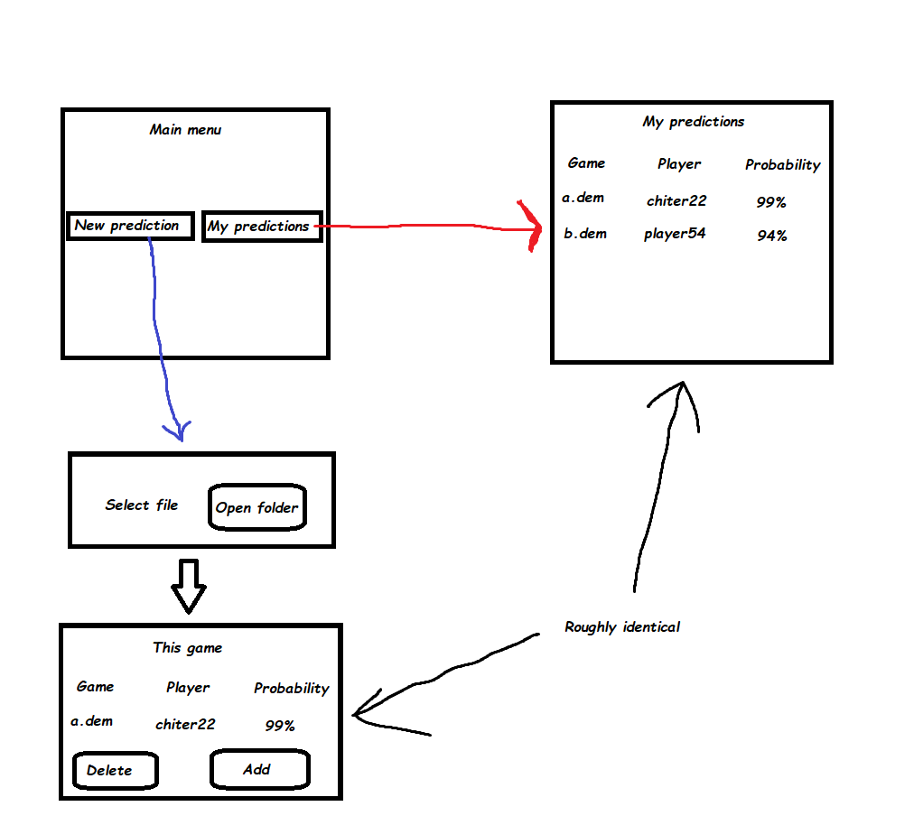

# Vaatimusmäärittely

**Huom!** Projekti on jatkoa omalle projektille jota jo tehty pitkään. Löydettävissä: https://github.com/LaihoE/DLAC

## Sovelluksen tarkoitus

Sovellus analysoi CSGO (fps-peli) pelaajia ja ennustaa miten todennäköisesti pelaaja on 
huijari (käyttää jotain avustusta jota ei saisi). Yksi esimerkki  tämmöisestä on ns. "Aimbot" jossa
pelaajalla on jokin sovellus joka auttaa pelaajaa tähtäämään vihollisiin.

Jokainen CSGO peli jota pelataan tuottaa .dem tiedoston joka sisältää kaiken kommunikaation serverin ja
pelaajien välillä kyseisessä pelissä. .dem tiedostosta kerätään kiinnostavaa dataa esim. miten pelaaja liikutti
hiirtään juuri ennen kuin ampui toisen pelaajan. Kyseinen data kerätään .dem tiedostosta ja laitetaan .CSV 
tiedostoon.

CSV tiedosto luetaan Pythonilla josta se sitten lähetetään koneoppialgoritmin läpi joka palauttaa todennäköisyydet. 
Tässä kohtaa ei tarvite panikoida, sillä mitään koneoppia ei tarvitse osata sillä kaikki koneoppi on "piilossa" ja 
ainoa RIVI koodia missä on "koneoppia" on muotoa: todennäköisyydet = model.predict(data), eli annamme funktiolle numpy 
arrayn ja saamme takaisin myös numpy arrayn.

Lähes kaikki koodi on siis aivan normaalia Pythonia. Kurssin aikana fokus on luoda käyttäjäystävällisempi kokemus
esim. GUI:n avulla, mutta myös parantaa koodia ja lisätä testejä yms.

Koska parseri (se joka lukee .dem tiedoston ja palauttaa CSV tiedoston) on kirjoitettu GO:lla, sekä monien muiden ongelmien
takia, jätetään se pois tällä kurssilla. Generoin siis valmiiksi joitain CSV tiedostoja joita sitten käytetään projektin
testaamiseen. 

## Käyttöliittymä

## Käyttäjät

Käyttäjiä on näillä näkymin vain yksi, normaali käyttäjä.

## Perusversion tarjoama toiminnallisuus
- Käyttäjä voi GUI:n avulla valita tiedoston mitä analysoi
- Ennustukset menevät tietokantaan (sqlite)
- Käyttäjän vanhat ennustukset näkyvät "my predictions" osan alta
- Käyttäjä voi valita siirtääkö ennustuksen "my predictions" osaan, vai poistaako sen

## Jatkokehitysideoita
- Mahdollinen login
- "My predictions":iin lisää toiminnallisuutta esim. joitain filtereitä
- "My predictions":iin mahdollisuus lisätä kommentteja
- Loading bar
