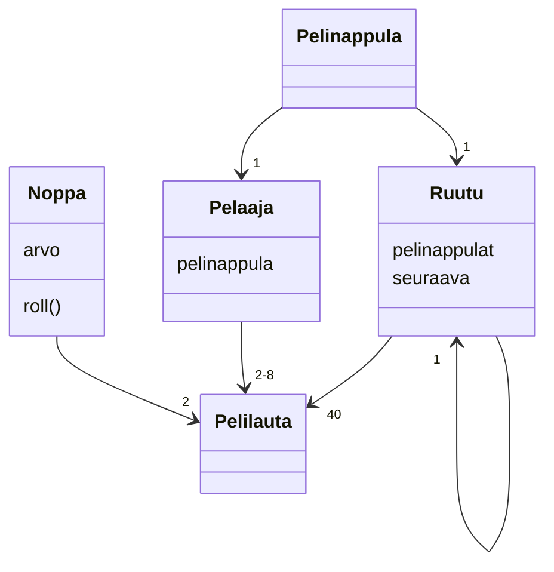

```mermaid
  classDiagram
    Ruutu  --> "40" Pelilauta
    Pelaaja --> "2-8" Pelilauta
    Pelinappula --> "1" Ruutu
    Pelinappula --> "1" Pelaaja
    Ruutu  --> "1" Ruutu
    Noppa --> "2" Pelilauta

    class Pelilauta{
    }
    class Pelaaja{
        pelinappula
    }
    class Noppa{
        arvo
        roll()
    }
    class Ruutu{
        pelinappulat
        seuraava
    }
    class Pelinappula{
    }
```