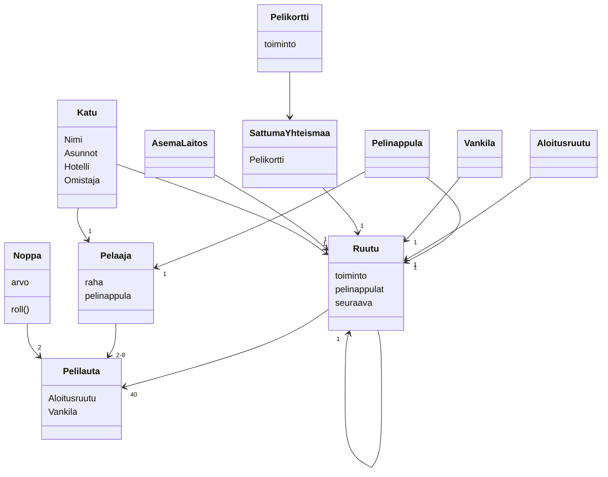

```mermaid
  classDiagram
    Ruutu  --> "40" Pelilauta
    Pelaaja --> "2-8" Pelilauta
    Pelinappula --> "1" Ruutu
    Pelinappula --> "1" Pelaaja
    Ruutu  --> "1" Ruutu
    Noppa --> "2" Pelilauta

    Aloitusruutu --> "1" Ruutu
    Vankila --> "1" Ruutu
    SattumaYhteismaa --> "1" Ruutu
    AsemaLaitos --> "1" Ruutu
    Katu --> "1" Ruutu
    Pelikortti --> "" SattumaYhteismaa
    Katu --> "1" Pelaaja

    class Pelilauta{
        Aloitusruutu
        Vankila
    }

    class Pelaaja{
        raha
        pelinappula
    }

    class Noppa{
        arvo
        roll()
    }
    class Ruutu{
        toiminto
        pelinappulat
        seuraava
    }
    class Pelinappula{
    }

    class Aloitusruutu{
    }
    class Vankila{
    }
    class SattumaYhteismaa{
        Pelikortti
    }
    class AsemaLaitos{
    }
    class Katu{
        Nimi
        Asunnot
        Hotelli
        Omistaja
    }

    class Pelikortti{
        toiminto
    }

```