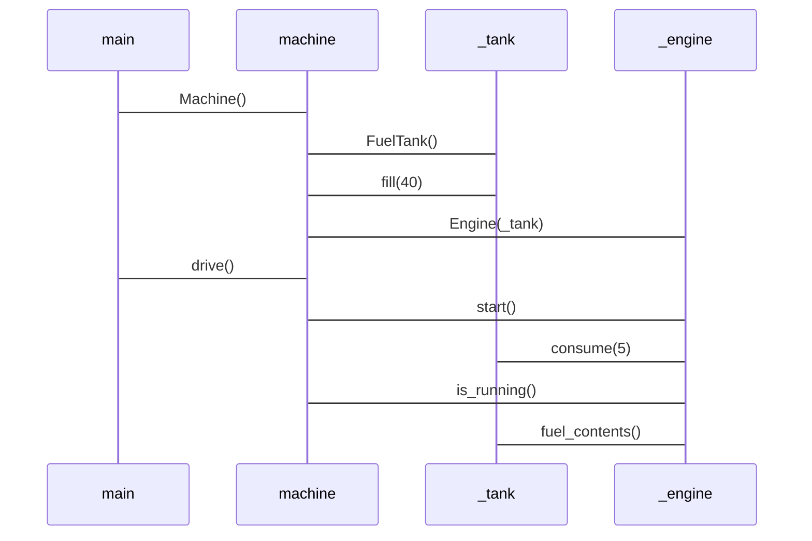

```mermaid

sequenceDiagram
    main->machine: Machine()
    machine->_tank:FuelTank()
    machine->_tank:fill(40)
    machine->_engine:Engine(_tank)

    main->machine:drive()
    machine->_engine:start()
    _engine->_tank:consume(5)
    machine->_engine:is_running()
    _engine->_tank:fuel_contents()
```