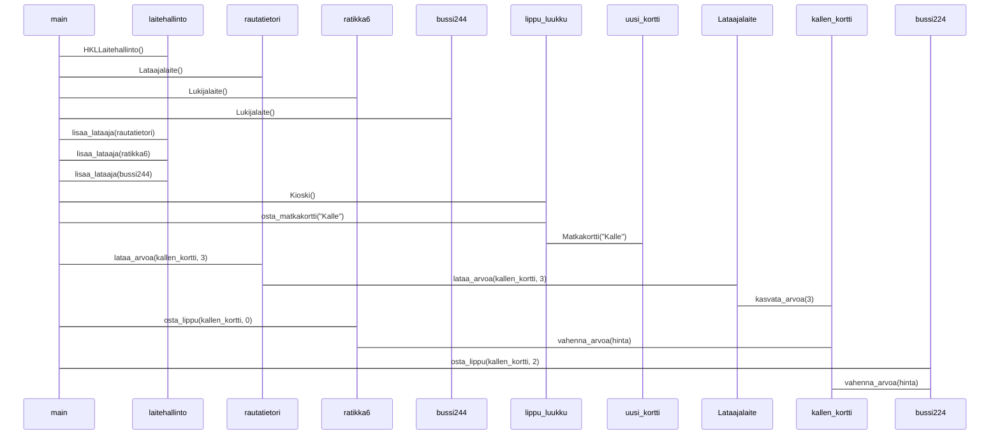

```mermaid

sequenceDiagram

    main->laitehallinto: HKLLaitehallinto()

    main->rautatietori: Lataajalaite()
    main->ratikka6: Lukijalaite()
    main->bussi244: Lukijalaite()


    main->laitehallinto: lisaa_lataaja(rautatietori)
    main->laitehallinto: lisaa_lataaja(ratikka6)
    main->laitehallinto: lisaa_lataaja(bussi244)

    main->lippu_luukku: Kioski()

    main->lippu_luukku: osta_matkakortti("Kalle")
    lippu_luukku->uusi_kortti: Matkakortti("Kalle")

    main->rautatietori: lataa_arvoa(kallen_kortti, 3)
    rautatietori->Lataajalaite: lataa_arvoa(kallen_kortti, 3)
    Lataajalaite->kallen_kortti: kasvata_arvoa(3)

    main->ratikka6: osta_lippu(kallen_kortti, 0)
    ratikka6->kallen_kortti: vahenna_arvoa(hinta)

    main->bussi224: osta_lippu(kallen_kortti, 2)
    bussi224->kallen_kortti: vahenna_arvoa(hinta)


```